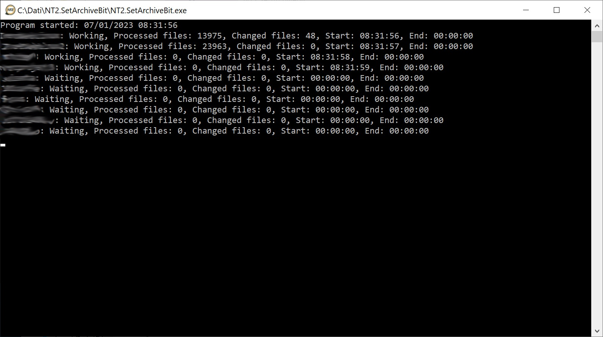

<h1 align="center">
  <br>
  <a href="https://www.nt2.it/"></a>
  <br>
  Set Archive Bit
  <br>
</h1>

<h3 align="center">A simple utility to set the archive bit on a Samba share according to the Last Changed time.</h3>
<p>
	Our need was to allow our Backup software to perform incremental backups on a set of Samba shares hosted by different Linux machines. <br/>
	The backups are performed by a Windows software which uses the Archive bit to identify the files that have been changed since the last full or incremental backup. 
	For the files changed via the Samba share this was not an issue (Samba sets the Archive bit for the files it change through the share), but for the files changed natively by Linux
	the Archive bit is never set. <br/>
	So our problem was to identify the files that were changed since the last full or incremental backup, and this utility was realized for this purpose. <br/>	
</p>

<p align="center">
  <a href="#key-features">Key Features</a> •
  <a href="#how-to-use">How To Use</a> •
  <a href="#configuration">Configuration</a> •
  <a href="#credits">Credits</a> •
  <a href="#disclaimer">Disclaimer</a> •
  <a href="#changelog">Changelog</a> •
  <a href="#license">License</a>
</p>



## Key Features

* Set the archive bit of the files in a Samba share according to the Last Change Time.
* Save the last execution time for each share in the configuration file to allow to be run every day.
* Works in multithread up to n threads set in the configuration file.
* Reserve a day of week for the full backup. In this case the share is not processed (since anyway all the files will be backed-up), the program will only save the last execution time of the share.
* Save a summary log of its operation and a detailed report for each error. 
* In case of error sends a warning email.

## How To Use

* Download the last version of the program
* Set the configuration settings in the appsettings.json and log4net.config files
* Run the program

The command line arguments are:
* -testemail - Sends a test email and quit the program;
* -share:<sharename> - Process only the selected share;

Example:
NT2.SetArchiveBit.exe -testemail
NT2.SetArchiveBit.exe -share:nt2


## Configuration
The program settings that are stored in the appsettings.json are the following:
* MaxThreads: The number of shares processed simultaneously.
* FullDayBackup: The day of the week where the full backup is performed. 0=sunday, 1=monday, ... . Set to null or 7 if you don't use this feature.
* EmailSettings: This settings are for the notification emails
  - PrimaryDomain: The SMTP server address
  - PrimaryPort: The port of the server where the SMTP services are accessible
  - UsernameEmail: Username to use if the SMTP auth is required
  - UsernamePassword: Password of the username above
  - FromEmail: Sender address,
  - FromName: Sender nice name,
  - ToEmail: Recipient address for the notification emails. You can use multiple addresses separated by ";"
  - CcEmail: Recipient address added in CC. 
  - UesSSL: true or false if SSL is required
  - ErrorEmailSubject: Subject of the notification email  
* Shares: The array of shares to process
  - Name: Unique name or alias of the share
  - UNCPath: The path of the Samba share
  - Domain: Domain or Workgroup of the user used to connect to the share
  - Username: The username. If it is not needed leave blank
  - Password: As above
  - LastProcessed: The date/time of last execition of this share. If left blank will be set by the program after the first execution
  - ExcludedFolders: An array of directory names to exclude from the processing

Example: 
```
{
  "MaxThreads": 4,
  "FullDayBackup": 1, //DayOfWeek of the full backup (0=sunday, 1=monday, ...)
  "EmailSettings": {
    "PrimaryDomain": "myservername.company.com",
    "PrimaryPort": "25",
    "UsernameEmail": "",
    "UsernamePassword": "",
    "FromEmail": "archivebit@company.com",
    "FromName": "ArchiveBit Utility",
    "ToEmail": "admin@company.com",
    "CcEmail": "",
    "UesSSL": false,
    "ErrorEmailSubject": "Error in NT2.SetArchiveBit"
  },
  "Shares": [
    {
      "Name": "Server1",
      "UNCPath": "\\\\server1.localdomain\\data",
      "Domain": "domain",
      "Username": "backupuser1",
      "Password": "backuppassword1",
      "LastProcessed": "2022-12-01T00:00:00Z",
      "ExcludedFolders": [ "ciao", "fOlder", ".bundle", ".github" ]
    },
    {
      "Name": "Server2",
      "UNCPath": "\\\\server2.localdomain\\data",
      "Domain": "domain",
      "Username": "backupuser2",
      "Password": "backuppassword2"
      "LastProcessed": "2022-12-01T00:00:00Z",
      "ExcludedFolders": [ "ciao", "fOlder", ".bundle", ".github" ]
    },
    {
      "Name": "Server3",
      "UNCPath": "\\\\server2.localdomain\\data",
      "Domain": "",
      "Username": "",
      "Password": ""
    }
  ]
}
```


## Credits

&copy; 2023 NT2 - Nuove Tecnologie S.r.l., Milano, Italy. 

## Disclaimer

THE SOFTWARE IS PROVIDED “AS IS”, WITHOUT WARRANTY OF ANY KIND, EXPRESS OR IMPLIED, INCLUDING BUT NOT LIMITED TO THE WARRANTIES OF MERCHANTABILITY, FITNESS FOR A PARTICULAR PURPOSE AND NONINFRINGEMENT.

## Changelog
* 1.0 : Initial version.

## License

GNU AGPL

